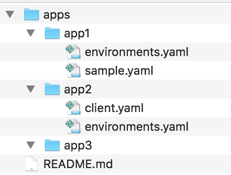
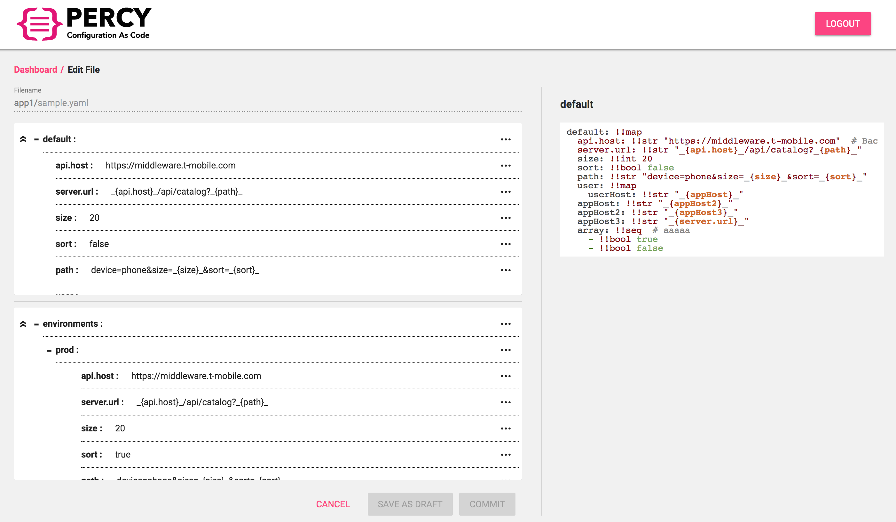

# YAML EDITOR

## Overview

This app is an Angular 6 web app to provide an editor for yaml configuration files.

The editor works for the mono configuration directory structure in git repository. In **apps** folders each subfolder(**app1**, **app2**...) represents an app, and contains the yaml configuration files:




Editor screenshot:




## Feature List

- Shallow clone from specific repo url and branch
- An intuitive structured tree view
- Create/edit/delete functions, and save draft changes in browser
- Resolve conflicts when commit changes
- Variable reference and environment inherits in yaml files


## How it works

[Material components](https://material.angular.io/components/categories) are used extensively to build UI interface. [@ngrx](http://ngrx.github.io/) is used for reactive state management of the UI.

[isomorphic-git](https://github.com/isomorphic-git/isomorphic-git) is used to clone remote git repo and commit changes. Repo files and draft changes are all saved in browser by using [BrowserFS](https://github.com/jvilk/BrowserFS) which simulates a file system (with IndexedDB as underlying storage).

If this web app is hosted in a different domain than the git server domain, a [CORS proxy](https://github.com/isomorphic-git/isomorphic-git#cors-support) server need be setup to allow cross sites requests.


## Known Issues

The browser filesystem is built on top of IndexedDB, the perfomance and stablitity is limited by IndexedDB and thus is not good as a real filesystem.

To relieve the impact, we have adopted serveral ways to reduce file I/O:

- Shallow clone with 1 depth
- Fetch remote commits with 1 depth
- After clone/fetch, we never checkout the files to working copy, just saving the git packed objects/files and will directly use the packed objects/files afterwards.


## Configuration

There are 3 configuration files:

- [src/percy.conf.json](src/percy.conf.json): configuration used in development
- [src/percy.conf.test.json](src/percy.conf.test.json): configuration used in Karma test
- [src/percy.conf.prod.json](src/percy.conf.prod.json): for production configuration, it will be copied to `dist/percy.conf.json` in production build

| Variable                 | Description                                                  |
| ------------------------ | ------------------------------------------------------------ |
| corsProxy                | The cors proxy for isomorphic-git                            |
| defaultBranchName        | Default branch name shown in login page                      |
| defaultRepositoryUrl     | Default repository url shown in login page                   |
| lockedBranches           | Locked branches                                              |
| storeName                | The browser indexeddb store name                             |
| reposFolder              | The browserfs folder to clone repos into                     |
| draftFolder              | The browserfs folder to store draft files                    |
| metaFolder               | The browserfs folder contains metadata file                  |
| repoMetadataVersion      | The repo metdata version (in case the structrure of repo metadata changes, update this version) |
| loggedInUsersMetaFile    | The file name which contains logged in user names            |
| yamlAppsFolder           | The folder name which contains apps' yaml config             |
| environmentsFile         | The environment file name (JUST file name)                   |
| pullTimeout              | The pull timeout, in which case will switch to clone         |
| loginSessionTimeout      | The login session timeout, like "1m", "2.5 hrs", "2 days". Default to 30m. |
| encryptKey               | The key used to encrypt security information like password   |
| encryptSalt              | The salt used to encrypt security information like password  |
| variableSubstitutePrefix | The Yaml variable substitute prefix                          |
| variableSubstituteSuffix | The Yaml variable substitute suffix                          |


## Development

Prerequisite

- Node.js 10
- Npm 6

```bash
# Install dependencies
npm i

# Lint code
npm run lint

# Run unit tests
npm test

# Start development server at http://localhost:4200
npm start
```


## Run from Docker

Prerequisite

- Docker
- Docker Compose


Build app (which will build in production mode), the static assets are built under `dist`:

```bash
./docker/build.sh

# After build, 3 files will be generated in 'dist':
# index.html
# percy.bundle.min.js
# percy.conf.json (which is a copy of src/percy.conf.prod.json)
```


Run docker compose:

```bash
docker-compose -f ./docker/docker-compose.yml up --build
```


In this step supports config the nginx port, you can refer to [docker/docker-compose.yml](docker/docker-compose.yml)  :

| Environment | Description                                                  |
| ----------- | ------------------------------------------------------------ |
| NGINX_PORT  | The nginx server port. The nginx will serve both the static assets in `dist` and the isomorphic-git proxy. |


Assume `NGINX_PORT` is configured as 8080, then you can visit http://localhost:8080