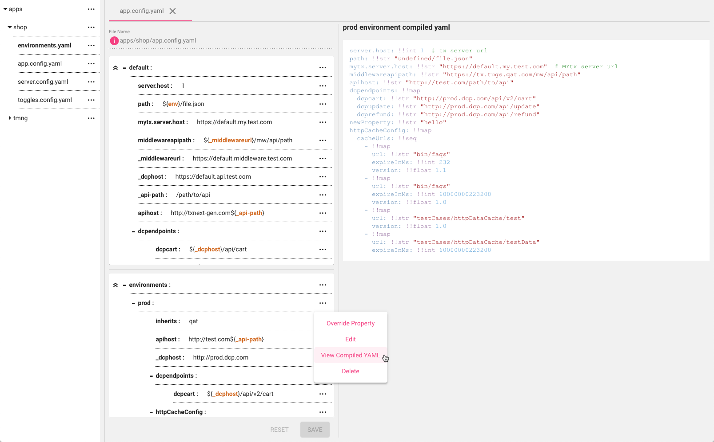

# Overview

_*Build Once, Deploy anywhere.*_

# Percival - a Configuration as Kode editor (with Hydration Tools)

## Percy-CaKe 



[Full BLOG introducing Percy-Cake](/docs/BLOG.md)


The editor is available in 4 flavors:
1. [Web Application](#staticAssets)
2. [Docker container hosting web application](packages/docker/readme.docker.md)
3. [Electron application](packages/electron/readme.electron.md)
4. [VSCode extension](packages/vscode/readme.vscode.md)


## Percy Hydration Tools

`npm install percy-cake-hydration-tools`

For more information on how to use the hydration tools please refer to the [hydration tools README](/packages/hydration-script/README.md)

# FAQ:

- [What is Configuration As Kode](docs/faq.md) ?
- [Why `Percy`](docs/faq.md)?
- [Why `YAML`](docs/faq.md) ?
- Editor Overview _TBD_
- File Hydration Utility Scripts _TBD_


# Development

Prerequisite

- Node.js 10
- Npm 6

```bash
# Install dependencies
npm install -g lerna
lerna bootstrap --hoist

# Lint code
lerna run lint --stream

# Run unit tests
lerna run test --stream

# Start development server at http://localhost:4200
lerna run --scope=percy-cake-web-app --stream start
```

# Percy Runtime Modes:

The Percy Configuration Editor application has **Five** different runtimes that share the same core application modules!

## 1. Local Development server

the Percy editor can be run using the webpack development server for local testing and development.

```bash
# Build and Start development server at http://localhost:4200
lerna run --scope=percy-cake-web-app --stream start
```

## <a name="staticAssets"></a>2. Static assets

The Percy editor can be deployed as packaged static assets to any CDN or web server.

```bash
# build the application
lerna run --scope=percy-cake-web-app --stream build:prod

```

### static assets are located at

`packages/webapp/dist/build/`

- `favicon.png`
- `index.html`
- `percy.bundle.min.js`
- `percy.conf.json`

## 3. Docker container

The Percy editor can be packaged and run as web application within a docker container;
[click here](packages/docker/readme.docker.md) for more information.

## 4. VSCode editor extension

The Percy editor can be run as a vscode extension that provides an IDE editor for app config files following the Percy yaml format;
[click here](packages/vscode/readme.vscode.md) for more information.

## 5. Percy Electron App

The Percy editor can be run as a standalone desktop application;
[click here](packages/electron/readme.electron.md) for more information


## Usage

Log in with your username / password of your git account, the URL and branch of your configuration repository.
The editor dashboard will load the YAML files in each application folder from your repository.
Then you can select any file to edit, delete a file or add a new file to the application.

On the add / edit page, the `SAVE AS DRAFT` button will only save your changes locally, the changes are only committed and pushed to the repository when you click `COMMIT` button.
You can also save multiple files as draft, and use the 'COMMIT CHANGES' button on the dashboard page to commit and push changes altogether.

The environment nodes have a `View Compiled YAML` option, which will generate a preview of environment specific YAML file that user uses in application deployment. It does the similar thing as the `hydrate.js` script mentioned above. In this view, all inheritances and variables will be resolved.

Here is a brief [video](https://www.youtube.com/watch?v=Ealtb91SUFM&feature=youtu.be) to demonstrate the features.

## Feature List

- Load YAML files from a mono structured repository
- Display YAML file in an intuitive structured tree view
- Support YAML property with object, bool, string, number types, and an array of simple types
- Create a new YAML file
- Edit an existing YAML file
- Delete an existing YAML file
- Save draft changes locally in the browser
- Commit changes to the repository
- Resolve conflicts when committing changes
- Define variables at the top-level, and use the variables anywhere in the YAML file
- The environment node has a special `inherits` property, it can be used to inherit from another environment node. Note that all environment nodes inherit from the default node by default.
- View the compiled YAML of the environment node, in this view, the inherits and variables will be resolved.

## How it works

The editor is created with Angular 7, and [Material components](https://material.angular.io/components/categories) are used extensively to build UI interface. [@ngrx](http://ngrx.github.io/) is used for reactive state management of the UI.

[isomorphic-git](https://github.com/isomorphic-git/isomorphic-git) is used to clone remote git repo and commit changes. Repo files and draft changes are all saved in the browser by using [Filer](https://filer.js.org/) which simulates a file system (with IndexedDB as underlying storage).

If this web app is hosted in a different domain than the git server domain, a [CORS proxy](https://github.com/isomorphic-git/isomorphic-git#cors-support) server need to be set up to allow cross sites requests.

## Known Issues

The browser filesystem is built on top of IndexedDB, the performance and stability are limited by IndexedDB and thus is not as good as a real filesystem.

To relieve the impact, we have adopted several ways to reduce file I/O:

- Shallow clone with 1 depth
- Fetch remote commits with 1 depth
- After clone/fetch, we never check out the files to working copy, just saving the git packed objects/files and will directly use the packed objects/files afterwards.
- We use an in-memory cache layer in front of the IndexedDB. Due to the fact that read file operations are much more frequent than write file operations, the cache layer improves the user experience a lot. For write operations, the cache uses write-through strategy to ensure data updates are safely stored on IndexedDB.

## Configuration

There are 3 configuration files:

- [packages/webapp/src/percy.conf.json](packages/webapp/src/percy.conf.json) and [packages/electron/src/percy.conf.json](packages/electron/src/percy.conf.json): configuration used in development
- [packages/webapp/src/percy.conf.test.json](packages/webapp/src/percy.conf.test.json): configuration used in Karma test
- [packages/webapp/src/percy.conf.prod.json](packages/webapp/src/percy.conf.prod.json) and [packages/electron/src/percy.conf.prod.json](packages/electron/src/percy.conf.prod.json): for production configuration, which will be copied to `packages/webapp/dist/percy.conf.json` and `packages/webapp/dist/build/percy.conf.json` in the production build

| Variable              | Description                                                                                                                                                  |
| --------------------- | ------------------------------------------------------------------------------------------------------------------------------------------------------------ |
| corsProxy             | The cors proxy for isomorphic-git (This config is only useful in webapp and irrelevant for Electron app, since Electron app does not need cors proxy server) |
| defaultRepositoryUrl  | Default repository url shown on login page                                                                                                                   |
| lockedBranches        | Locked branches, you cannot checkout these branches on dashboard page                                                                                        |
| storeName             | The browser indexeddb store name                                                                                                                             |
| reposFolder           | The browserfs folder to clone repos into                                                                                                                     |
| draftFolder           | The browserfs folder to store draft files                                                                                                                    |
| metaFolder            | The browserfs folder contains metadata file                                                                                                                  |
| repoMetadataVersion   | The repo metdata version (in case the structrure of repo metadata changes, update this version)                                                              |
| loggedInUsersMetaFile | The file name which contains logged in user names                                                                                                            |
| yamlAppsFolder        | The folder name which contains apps' yaml config                                                                                                             |
| environmentsFile      | The environments file name (JUST file name)                                                                                                                  |
| loginSessionTimeout   | The login session timeout, like "1m", "2.5 hrs", "2 days". Default to 30m.                                                                                   |
| encryptKey            | The key used to encrypt security information like password                                                                                                   |
| encryptSalt           | The salt used to encrypt security information like password                                                                                                  |
| variablePrefix        | The YAML variable substitute prefix                                                                                                                          |
| variableSuffix        | The YAML variable substitute suffix                                                                                                                          |
| variableNamePrefix    | The YAML variable variable name prefix                                                                                                                       |
| envVariableName       | The YAML environment variable name                                                                                                                           |

The git repository can contain optional `.percyrc` files, which provide repository-specific or application-specific configuration. The following properties are supported now:

| Property             | Description                                                                                               |
| -------------------- | --------------------------------------------------------------------------------------------------------- |
| `variablePrefix`     | prefix wrapper for variable substitution expressions                                                      |
| `variableSuffix`     | suffix wrapper for variable substitution expressions                                                      |
| `variableNamePrefix` | prefix to variables used for substitution only and should not be included independently in hydrated files |
| `envIgnorePrefix`    | prefix to abstract environment name                                                                       |
| `envIgnoreSuffix`    | suffix to abstract environment name                                                                       |
| `envVariableName`    | The YAML environment variable name                                                                        |         

### value substitution

The Percy format support value sustitution thru a templating regex. You can define the character string that occurs _before_ and _after_ a property name that should be replaced with it's defined value:

value substitution can work by replacing the entire value of a property,

```yaml
"name": !!map
  "first": !!str "Kendrick"
  "last": !!str "Burson"
...
"intro" !!map
   "owner": !!map ${name}
```

or interpolated within a string

```yaml
"weekNumber": !!int 4
---
"tenure": !!str "This is week ${weekNumber} of my internship"
```

### environment templates

Percy also supports environment templates for easy sharing of code patterns thru inheritance. Note, every environment inherits from the `default` _by default_ but can inherit inherit from 1 other defined environment. Environment inheritance cascades with the last inherited value taking precedence.

With environment temnplates you can define a collection of abstract environment definitions

TBD

If it's in the `apps` folder, the configuration applies to all applications, and if it's in the specific application folder, it only applies to the corresponding application. When provided, the default properties from the `percy.conf.json` will be overridden.

Here is an example of `.percyrc` file:

```json
{
  "variablePrefix": "${",
  "variableSuffix": "}",
  "variableNamePrefix": "_",
  "envIgnorePrefix": "",
  "envIgnoreSuffix": "_tpl",
  "envVariableName": "env"
}
```


===============================================================================================================

# License

Percy editor and hydration scripts are open-sourced under Apache 2.0 and is released AS-IS WITHOUT WARRANTIES OR CONDITIONS OF ANY KIND under the terms of Section 7 of the Apache license.

# DISCLAIMER

T-Mobile® has made every reasonable effort to test the code for its intended purpose, as anticipated by T-Mobile®. T-Mobile® further acknowledges that the code may be used on a wide range of platforms and in many different contexts. Accordingly, it is likely that the code will need to be modified. Please have your IT team validate the code prior to any production use.
