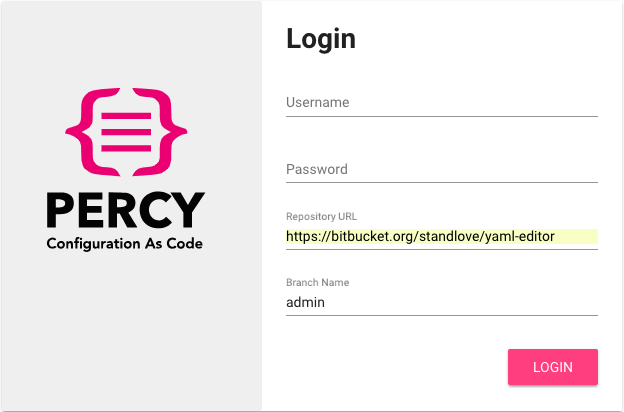
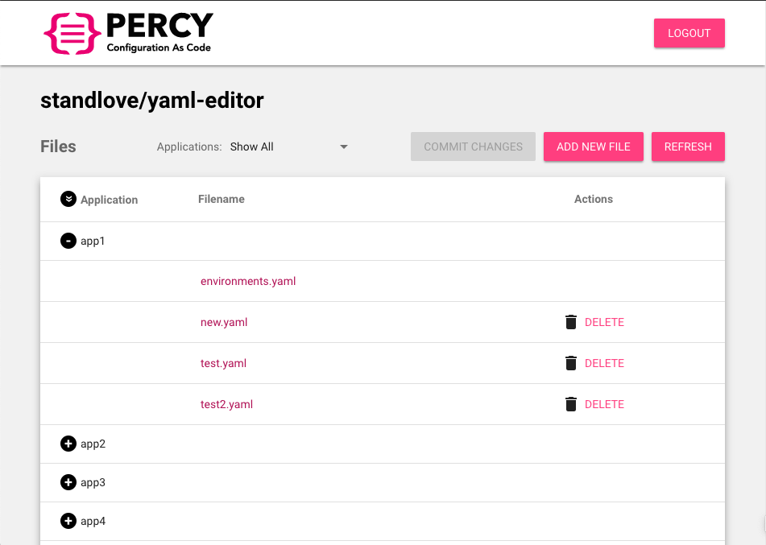
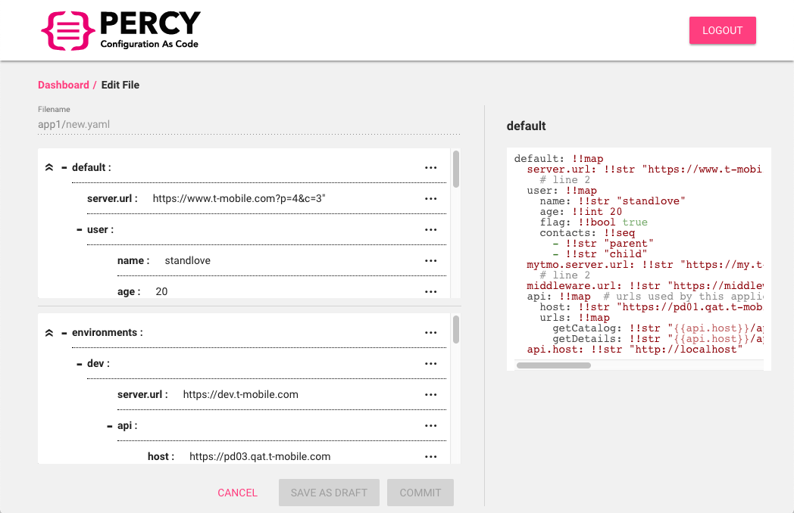
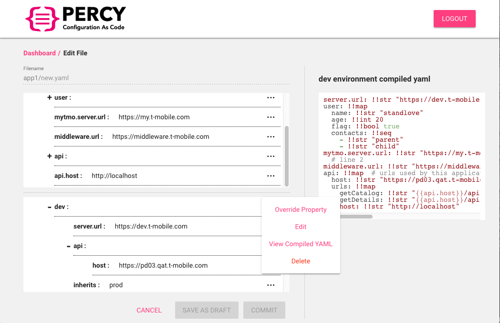

# Percy YAML Editor

## Overview

The editor allows the user to manage (create, edit or delete) YAML configuration files from a git repository in the browser directly. 

The editor is a pure static web page, and it doesn't require any back-end. But a proxy is needed for it to access the git repository successfully.

The editor is able to fetch the YAML configuration files in the git repository, make changes, and then save changes back to the git repository. It's also able to add or delete YAML configuration files in the git repository.

The git repository to be managed by this editor must follow the mono directory structure as below:
```
apps/
  +- app1/
  |    +- client.config.yaml
  |    +- server.config.yaml
  |    +- feature.toggles.yaml
  |    +- environments.yaml
  |    +- hydrate.js
  |    +- readme.md
  +- app2/
  |    +- client.config.yaml
  |    ...
  ...
libs/
  +- hydration.libs.hjs
  +- readme.md
readme.md
```

It must have an `apps` directory (the directory name is configurable), with each sub-directory representing an application.  The editor will load all applications together with all the YAML files in each application and ignore all the non-YAML files. 

In each application folder, all YAML files must follow the format below:
```
default: !!map


environments: !!map

```

The `default` node contains the default configuration properties for the application, and the `environments` node contains multiple environment nodes, with each environment node inheriting from the `default` node. 

In environment node, you can override properties defined in the `default` node to provide different values.

And here is an example of YAML file, and you can notice the `environments` node contains `prod`, `dev` and `qa` environment nodes. 
```
default: !!map
  server.host: !!int 1  # TMO server url
  mytmo.server.host: !!str https://default.my.t-mobile.com  # MYTMO server url
  middlewareapipath: !!str _{$middlewareurl}_/mw/api/path
  $middlewareurl: !!str https://default.middleware.t-mobile.com  # Backend MW url
  $dcphost: !!str https://default.api.t-mobile.com
  $api-path: !!str /path/to/api
  apihost: !!str http://tmonext-gen.com_{$api-path}_
  dcpendpoints: !!map
    dcpcart: !!str _{$dcphost}_/api/cart
    dcpupdate: !!str _{$dcphost}_/api/update
    dcprefund: !!str _{$dcphost}_/api/refund
environments: !!map
  prod: !!map
    $middlewareurl: !!str https://e3.my.t-mobile.com  # Production middleware endpoint
    apihost: !!str http://t-mobile.com_{$api-path}_
    $dcphost: !!str http://prod.dcp.com
    dcpendpoints: !!map
      dcpcart: !!str _{$dcphost}_/api/v2/cart
  dev: !!map
    $middlewareurl: !!str https://tmo.tugs.dev.com  # Production middleware endpoint
    apihost: !!str http://t-mobile.com_{$api-path}_
    newProperty: !!str hello
  qa: !!map
    $middlewareurl: !!str https://tmo.tugs.qat.com  # Production middleware endpoint
    apihost: !!str http://t-mobile.com_{$api-path}_
```

Each application will have a special YAML file called `environments.yaml` (the file name is configurable), which defines all the environments supported by the application. So in the editor, when editing the other YAML files, you can simply select the environments pre-defined in this file. 


## Usage

Login with your username / password of your git account, the URL and branch of your configuration repository:


The editor will load the YAML files in each application folder from your repository:


Then you can select any file to edit:


View the compiled YAML:


You can also add a new YAML file or delete an existing YAML file. 

On the add / edit page, the `SAVE AS DRAFT` button will only save your changes locally, the changes are only committed and pushed to the repository when you click `COMMIT` button. 

You can also save multiple files as draft, and use the 'COMMIT CHANGES' button on the dashboard page to commit and push changes altogether. 


## Feature List

- Load YAML files from a mono structured repository
- Display YAML file in an intuitive structured tree view
- Support YAML property with object, bool, string, and number types, and array of simple types
- Create a new YAML file
- Edit an existing YAML file
- Delete an existing YAML file
- Save draft changes locally in the browser
- Commit changes to the repository
- Resolve conflicts when commit changes
- Define variables at the top-level, and use the variables anywhere in the YAML file
- The environment node has a special `inherits` property, it can be used to inherit from another environement node. Note that all environment nodes inherit from the default node by default. 
- View the compiled YAML of the environment node, in this view, the inherites and variables will be resolved. 


## How it works

[Material components](https://material.angular.io/components/categories) are used extensively to build UI interface. [@ngrx](http://ngrx.github.io/) is used for reactive state management of the UI.

[isomorphic-git](https://github.com/isomorphic-git/isomorphic-git) is used to clone remote git repo and commit changes. Repo files and draft changes are all saved in browser by using [BrowserFS](https://github.com/jvilk/BrowserFS) which simulates a file system (with IndexedDB as underlying storage).

If this web app is hosted in a different domain than the git server domain, a [CORS proxy](https://github.com/isomorphic-git/isomorphic-git#cors-support) server need be setup to allow cross sites requests.


## Known Issues

The browser filesystem is built on top of IndexedDB, the perfomance and stablitity is limited by IndexedDB and thus is not as good as a real filesystem.

To relieve the impact, we have adopted serveral ways to reduce file I/O:

- Shallow clone with 1 depth
- Fetch remote commits with 1 depth
- After clone/fetch, we never checkout the files to working copy, just saving the git packed objects/files and will directly use the packed objects/files afterwards.


## Configuration

There are 3 configuration files:

- [src/percy.conf.json](src/percy.conf.json): configuration used in development
- [src/percy.conf.test.json](src/percy.conf.test.json): configuration used in Karma test
- [src/percy.conf.prod.json](src/percy.conf.prod.json): for production configuration, it will be copied to `dist/percy.conf.json` in production build

| Variable                 | Description                                                  |
| ------------------------ | ------------------------------------------------------------ |
| corsProxy                | The cors proxy for isomorphic-git                            |
| defaultBranchName        | Default branch name shown on login page                      |
| defaultRepositoryUrl     | Default repository url shown on login page                   |
| lockedBranches           | Locked branches, you cannot enter these branches on login page   |
| storeName                | The browser indexeddb store name                             |
| reposFolder              | The browserfs folder to clone repos into                     |
| draftFolder              | The browserfs folder to store draft files                    |
| metaFolder               | The browserfs folder contains metadata file                  |
| repoMetadataVersion      | The repo metdata version (in case the structrure of repo metadata changes, update this version) |
| loggedInUsersMetaFile    | The file name which contains logged in user names            |
| yamlAppsFolder           | The folder name which contains apps' yaml config             |
| environmentsFile         | The environments file name (JUST file name)                   |
| pullTimeout              | The git pull timeout, in which case will switch to clone         |
| loginSessionTimeout      | The login session timeout, like "1m", "2.5 hrs", "2 days". Default to 30m. |
| encryptKey               | The key used to encrypt security information like password   |
| encryptSalt              | The salt used to encrypt security information like password  |
| variableSubstitutePrefix | The Yaml variable substitute prefix                          |
| variableSubstituteSuffix | The Yaml variable substitute suffix                          |


## Development

Prerequisite

- Node.js 10
- Npm 6

```bash
# Install dependencies
npm i

# Lint code
npm run lint

# Run unit tests
npm test

# Start development server at http://localhost:4200
npm start
```


## Run from Docker

Prerequisite

- Docker
- Docker Compose


Build app (which will build in production mode), the static assets are built under `dist`:

```bash
./docker/build.sh

# After build, 3 files will be generated in 'dist':
# index.html
# percy.bundle.min.js
# percy.conf.json (which is a copy of src/percy.conf.prod.json)
```


Run docker compose:

```bash
docker-compose -f ./docker/docker-compose.yml up --build
```


In this step supports config the nginx port, you can refer to [docker/docker-compose.yml](docker/docker-compose.yml)  :

| Environment | Description                                                  |
| ----------- | ------------------------------------------------------------ |
| NGINX_PORT  | The nginx server port. The nginx will serve both the static assets in `dist` and the isomorphic-git proxy. |


Assume `NGINX_PORT` is configured as 8080, then you can visit http://localhost:8080