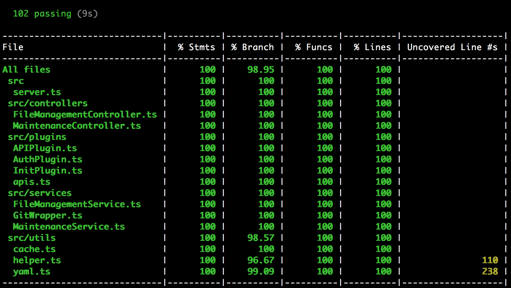
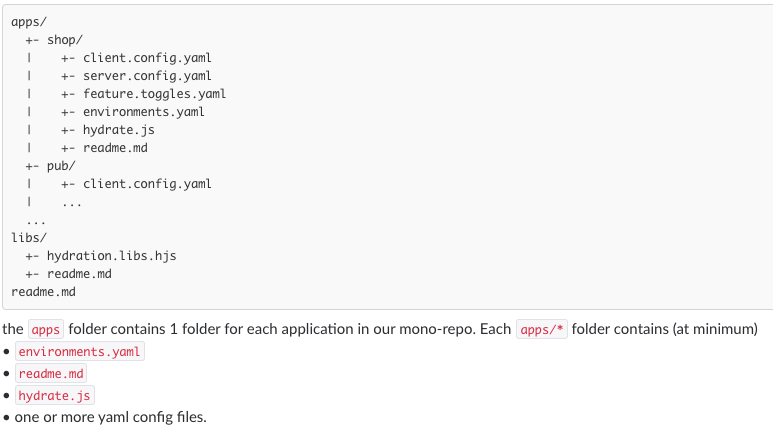

## Prerequisite

Node.js 10.9+

Git 2.15+

Postman 6.2+ for verification


## Install Git

The app uses [simple-git](https://www.npmjs.com/package/simple-git) nodejs library which delegates to the `git` command, so Git must be installed.


## Config app

- config/default.json: defines the default configuration for the app
- config/test.json: defines the configuration used for unit tests
- config/custom-environment-variables.json: defines the environment variables to override config
- config/ext-config.json: used to locally store the external config

App configuration:

| Name             | Environment       | Description                                                  |
| ---------------- | ----------------- | ------------------------------------------------------------ |
| port             | PORT              | The server port. Default to 3000                             |
| apiVersion       | API_VERSION       | The api version, used to construct rest api path             |
| logLevel         | LOG_LEVEL         | The log level                                                |
| reposFolder      | REPOS_FOLDER      | The folder to clone repos into                               |
| metaFolder       | META_FOLDER       | The folder contains metadata file                            |
| yamlAppsFolder   | YAML_APPS_FOLDER  | The folder name which contains apps' yaml config             |
| environmentsFile | ENVIRONMENTS_FILE | The environment file name (JUST file name)                   |
| healthcheckFile  | HEALTHCHECK_FILE  | The path to health check file                                |
| jwtSecret        | JWT_SECRET        | The JWT secret                                               |
| jwtExpiresIn     | JWT_EXPIRES_IN    | The JWT token expires in, like "1m", "2.5 hrs", "2 days". Default to 12 hours. |
| encryptKey       | ENCRYPT_KEY       | The key used to encrypt password                             |
| encryptSalt      | ENCRYPT_SALT      | The salt used to encrypt password                            |
| maxPayloadSize   | MAX_PAYLOAD_SIZE  | The max size of JSON request payload. Default to 1M.         |


When app starts, if `EXTERNAL_CONFIG_URL` env value exists, it will load external configuration from that URL, otherwise the locally stored `config/ext-config.json` will be used:

| Name           | Description                                                 |
| -------------- | ----------------------------------------------------------- |
| version        | The app version                                             |
| repositoryUrl  | The default repo URL which contains yaml files to be edited |
| branchName     | The default branch to checkout when cloning repo            |
| lockedBranches | The locked branches                                         |


(For simple verification, you can just use the default config)


## NPM commands

```bash
# Install dependencies
npm install

# Clean app, the "build" and "coverage" folders will be removed
npm run clean

# Build app, the typescripts within "src" and "test" folders
# will be built into "build" folder
npm run build

# Lint code
npm run lint

# Run unit tests, the coverage report will be generated in "coverage" folder
npm test

# Start app
npm start
```


The app started at http://localhost:3000 by default


## Unit Tests

Unit tests will mock the git behaviour of clone/pull/push, you don't need change config to run the tests.




## Verification

Setup a local http server to serve the external config, it is required to verify `/refreshConfiguration` api:

```bash
# Within the project root dir:
npm i -g http-server

# Start http-server:
http-server
```


**Create your own test repo, it should have a branch named "admin", because by default the "admin" branch will be checkout when cloning repo. And it should have files structure as following:**




Import collection file `doc/yaml-config-rest-api.postman_collection.json` and environment file `doc/yaml-config.postman_environment.json` to Postman.

Then config following Postman env values to your own test repo url and your own username/password:

- **repoURL**
- **branchName**
- **username**
- **Password**

(*The **token**, **repoName**  and **appName** are auto updated after calling to `/accessRepo`, you don't need manually change them*).


Check following apis in "Maintenance" folder:

- healthcheck
- log
- refreshConfiguration

- defaultRepo
- userTypeAhead


Then in "FileManagement" folder, you need run `/accessRepo` at first, which will clone the repo and grant access token (the repo is cloned under `repos` folder by default). After that, you can list/get/commit/delete file:

- accessRepo
- listApplications
- getEnvironments
- listFiles
- getFile
- commitFiles
- deleteFile